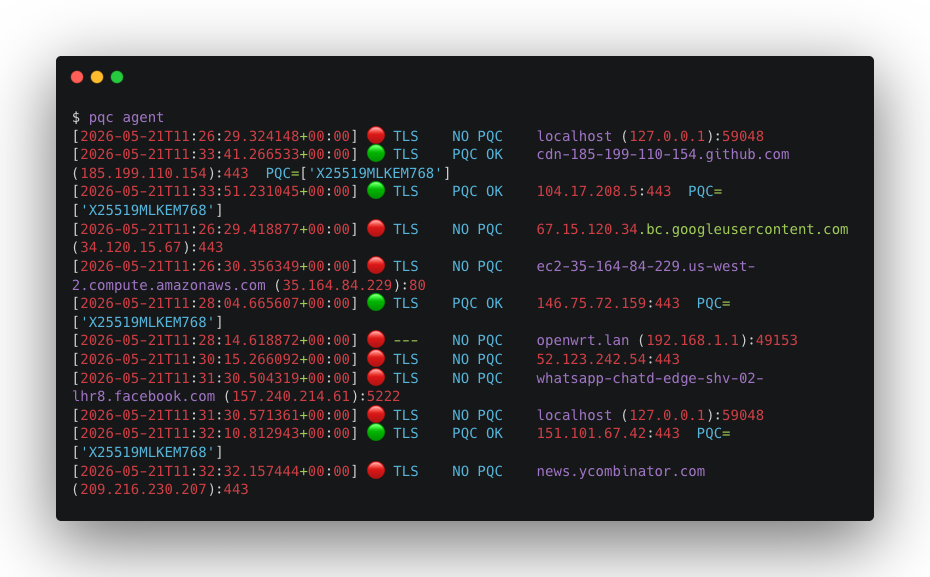

# PQC Tools

**Post-Quantum Cryptography readiness scanner and connection monitor.**

Quantum computers will soon break the RSA and elliptic-curve cryptography that
protects almost all internet traffic. Adversaries are already harvesting encrypted
data today to decrypt later — the "harvest now, decrypt later" threat. Governments
are now mandating the shift to post-quantum cryptography: the U.S. has set
aggressive timelines through NSA CNSA 2.0 and NIST standardization of ML-KEM and
ML-DSA; the UK NCSC requires government and critical national infrastructure to
begin PQC migration; and the EU's ENISA guidance and NIS2 framework are pushing
operators to audit and upgrade their cryptographic estates. These tools give
you a fast, automated way to aid verifying whether your endpoints are ready.

Checks whether TLS, SSH, and VPN endpoints support post-quantum cryptographic
algorithms (ML-KEM / Kyber, ML-DSA / Dilithium, FALCON, SPHINCS+, NTRU, …)
and gives a binary verdict:



| Status        | Meaning                                                                       |
| ------------- | ----------------------------------------------------------------------------- |
| 🔴 **NO PQC** | No post-quantum algorithms detected. Vulnerable to harvest-now-decrypt-later. |
| 🟢 **PQC OK** | At least one post-quantum algorithm was detected.                             |

In the future, we expect to extend these statuses so that green represents only PQC algorithms being available.

---

## Installation

```bash
brew tap The-CISO-Network/pqc https://github.com/The-CISO-Network/pqc
brew install pqc
```

---

## Part 1 — Scanner

Probe a single endpoint:

```bash
# Auto-detect protocol
pqc scan example.com 443
pqc scan github.com 22
pqc scan vpn.example.com 500

# Force protocol
pqc scan example.com 8443 --protocol tls
pqc scan bastion.internal 22 --protocol ssh

# JSON output (machine-readable / pipe to jq)
pqc scan example.com 443 --json

# Verbose — show all classical algorithms too
pqc scan example.com 443 -v
```

Example output:

```
────────────────────────────────────────────────────────────
  🟢  PQC OK
  Post-quantum algorithms detected.
────────────────────────────────────────────────────────────
  Host:     example.com:443
  Protocol: TLS

  PQC algorithms detected (1):
    ✓ x25519kyber768draft00
```

### Protocol support

| Protocol        | Default port                   | Probe method                                   |
| --------------- | ------------------------------ | ---------------------------------------------- |
| **TLS**         | 443 (+ common HTTPS-ish ports) | `sslyze` (deep) or `stdlib ssl` (stdlib)       |
| **SSH**         | 22                             | Raw TCP KEXINIT parse (no creds) or `asyncssh` |
| **IKEv2 / VPN** | 500, 4500                      | Raw UDP SA_INIT / SA response parse            |

---

## Part 2 — Agent

The agent daemon watches your host's active TCP connections and proactively
scans any observed endpoint, logging results.

```bash
# Watch specific targets
pqc agent example.com:443 github.com:22

# Watch ALL observed connections
pqc agent --scan-all

# With logging to NDJSON
pqc agent example.com:443 --log-file /var/log/pqc.json

# CSV log, 10-second poll, 60-second cooldown
pqc agent --scan-all \
  --poll-interval 10 \
  --cooldown 60 \
  --log-file pqc-results.csv
```

### How it works

The probe is **independent** of the observed connection — the agent opens its
own socket to enumerate algorithms without intercepting or modifying traffic.

### Log format

**NDJSON** (`.json`):

```json
{
  "timestamp": "2025-01-15T10:23:01+00:00",
  "host": "example.com",
  "port": 443,
  "protocol": "tls",
  "status": "pqc_available",
  "label": "PQC OK",
  "pqc_algorithms": ["x25519kyber768draft00"],
  "classical_algorithms": ["..."],
  "error": null
}
```

**CSV** (`.csv`): one row per scan, same fields.

---

## Optional dependencies

| Extra      | Package                                        | Benefit                                                  |
| ---------- | ---------------------------------------------- | -------------------------------------------------------- |
| `sslyze`   | [sslyze](https://github.com/nabla-c0d3/sslyze) | Deep TLS enumeration — all cipher suites, all KEX groups |
| `agent`    | [psutil](https://github.com/giampaolo/psutil)  | Reliable cross-platform connection table                 |
| `asyncssh` | [asyncssh](https://asyncssh.readthedocs.io)    | Richer SSH probing with negotiation details              |

Without any extras, the tool works using only Python's stdlib — connections are
still probed; just with slightly less detail.

---

## Algorithm coverage

PQC algorithms tracked (see `src/pqc/algorithms.py` for full list):

- **Key encapsulation**: ML-KEM (Kyber), FrodoKEM, BIKE, HQC, NTRU, NTRU Prime
- **Signatures**: ML-DSA (Dilithium), FN-DSA (FALCON), SLH-DSA (SPHINCS+)
- **Hybrids**: X25519+ML-KEM, P-256+ML-KEM, secp384r1+ML-KEM-1024

Contributions to expand coverage welcome.

---

## Contributing

PRs welcome. Areas of particular interest:

- Additional protocol probers (QUIC/HTTP3, WireGuard, OpenVPN)
- DTLS support
- Web dashboard / Prometheus exporter
- Package for apt / rpm

---

## License

MIT
